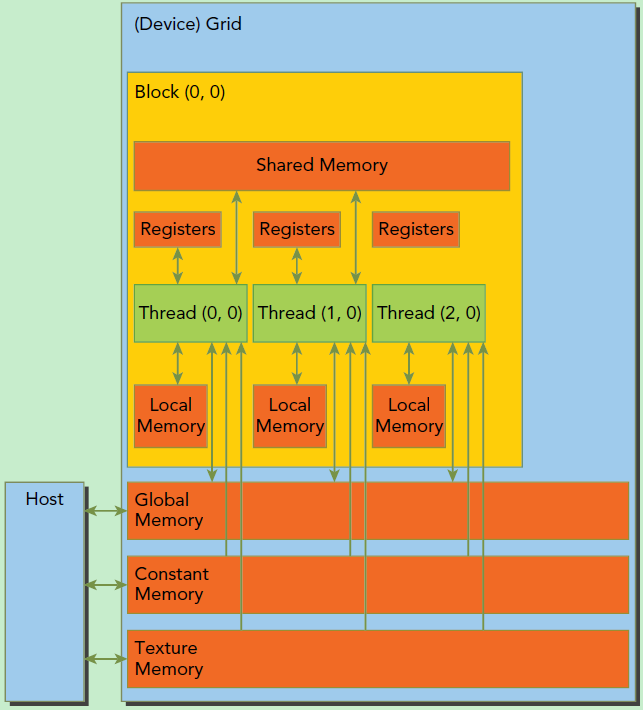

1. 共享内存
2. 线程同步
3. 示例

<!-- more -->

# cuda内存模型



# 共享内存

1. 共享内存比本地内存快的多；
2. 共享内存是按线程块分配的，因此块中的线程都可以访问同一个共享内存；
3. 一个线程可以从全局内存中加载数据到共享内存，然后同一个线程块中的其他线程就可以访问这些存储在共享内存中的数据；
4. 在CUDA中，共享内存有两种分配方式：
   * 静态分配：在内核中直接声明一个固定大小的共享内存数组，例如 `__shared__ int s[64];`。这种方式在编译时就确定了大小，灵活性较低。
   * 动态分配：使用 `extern __shared__` 声明共享内存，并在内核启动时通过参数指定大小。这种方式允许在运行时根据需要动态分配共享内存。

## 第三条说明

场景描述：

- 数组A存储在全局内存中，大小为N；
- 有一个线程块包含多个线程；
- 每个线程负责处理数组A中的一部分数据；

步骤：

1. 加载数据到共享内存
   * 线程块中的每个线程从全局内存加载一部分数据到全局内存；例如线程0加载A[0]到共享内存第0个位置，线程1加载A[1]到共享内存第1个位置，依次类推；
   * 这个需要进行线程同步，确保所有线程都完成了数据加载；
2. 访问共享内存中的数据
   * 数据加载完成后，线程块中的其他线程可以快速访问共享内存中的数据，比如线程0可以访问共享内存中的第1个位置即A[1];
   * 这种访问速度比直接从全局内存访问要快得多；

示例代码：

```cpp
__global__ void processArray(float *A, int N)
{
    // 定义共享内存
    __shared__ float sharedData[32];  // 假设线程块大小为32

    // 获取线程索引
    int tid = threadIdx.x;

    // 每个线程从全局内存加载数据到共享内存
    sharedData[tid] = A[tid];

    // 确保所有线程都完成了数据加载
    __syncthreads();

    // 线程可以访问共享内存中的数据
    float dataFromShared = sharedData[(tid + 1) % 32];  // 示例：访问下一个线程加载的数据

    // 进行计算（这里只是示例，具体计算逻辑根据需求而定）
    // ...
}
```

# 线程同步

一个线程的执行只能在其块中的所有线程都执行了 `__syncthreads()` 之后通过 `__syncthreads()` 继续执行。因此，我们可以通过在存储到共享内存之后和从共享内存加载任何线程之前调用 `__syncthreads()` 来避免上面描述的竞争条件。需要注意的是，在发散代码中调用 `__syncthreads()` 是未定义的，并且可能导致死锁，线程块中的所有线程都必须在同一点调用 `__syncthreads()` 。

## 1. `__syncthreads()` 的作用

`__syncthreads()` 是CUDA中的一个同步函数，用于在同一个线程块中的所有线程之间进行同步。它的作用是确保线程块中的所有线程在执行到 `__syncthreads()` 时，都必须暂停，直到所有线程都到达这个同步点，然后才会继续执行后续代码。
简单来说，`__syncthreads()` 的作用是**“让所有线程在这里等一等，直到大家都到了再一起出发”**。

## 2. 什么是“发散代码”？

在CUDA编程中，发散（Divergence）是指线程块中的线程因为执行路径不同而分叉的现象。具体来说，如果线程块中的线程在执行过程中因为条件判断（如 `if-else`）而走不同的分支，那么这些线程就会“发散”。
例如：

```cuda
if (threadIdx.x < 16) {
    // 一部分线程执行这个分支
} else {
    // 另一部分线程执行这个分支
}
```

在这种情况下，线程块中的线程会分成两组，分别执行不同的代码路径。

## 3. 发散代码中调用 `__syncthreads()` 是未定义的

当线程块中的线程因为发散而走不同的分支时，如果某个分支中调用了 `__syncthreads()`，而其他分支没有调用，就会导致问题。因为 `__syncthreads()` 的前提是**线程块中的所有线程都必须在同一个点调用它**。如果只有部分线程调用了 `__syncthreads()`，而其他线程没有调用，就会出现以下问题：

- **未定义行为**：CUDA运行时不知道如何处理这种情况，因为 `__syncthreads()` 的语义被破坏了。
- **死锁**：调用了 `__syncthreads()` 的线程会等待其他线程也调用它，但由于其他线程没有调用，这些线程会一直等待下去，导致死锁。

## 4. 正确的使用方式

为了避免上述问题，`__syncthreads()` 必须在所有线程都执行到同一个点时调用。换句话说，`__syncthreads()` 必须位于所有线程的共同执行路径上。
例如：

```cpp
__global__ void kernel(float *data) {
    if (threadIdx.x < 16) {
        // 一部分线程执行这个分支
    } else {
        // 另一部分线程执行这个分支
    }

    // 所有线程都会执行到这里，因此可以安全调用 __syncthreads()
    __syncthreads();

    // 后续代码
}
```

在这个例子中，所有线程在执行完各自的分支后，都会到达 `__syncthreads()`，因此这是安全的。

## 5. 错误的使用方式

如果 `__syncthreads()` 被放在发散代码中，就会导致问题。例如：

```cuda
__global__ void kernel(float *data) {
    if (threadIdx.x < 16) {
        __syncthreads();  // 错误：只有部分线程调用了 __syncthreads()
    } else {
        // 这些线程没有调用 __syncthreads()
    }
}
```

在这个例子中，只有 `threadIdx.x < 16` 的线程调用了 `__syncthreads()`，而其他线程没有调用，这会导致未定义行为或死锁。

# 示例代码

```cpp
#include <stdio.h>

// 如果共享内存数组大小在编译时已知
// 就像在 staticReverse 内核中一样
// 那么我们可以显式地声明一个该大小的数组，例如s[64]
// 由于全局内存总是通过线性对齐索引 t 访问
// 所以读写都可以实现最佳的全局内存合并
__global__ void staticReverse(int *d, int n)
{
  __shared__ int s[64]; // 静态分配共享内存
  int t = threadIdx.x;  // 当前线程索引
  int tr = n-t-1;       // 反转后的索引
  s[t] = d[t];          // 将全局内存中的数据加载到共享内存
  __syncthreads();      // 确保所有线程都已完成对共享内存的加载
  d[t] = s[tr];         // 从共享内存中读取反转后的数据
}

__global__ void dynamicReverse(int *d, int n)
{
  extern __shared__ int s[];    // 动态分配共享内存
  int t = threadIdx.x;          // 当前线程的索引
  int tr = n-t-1;
  s[t] = d[t];
  __syncthreads();
  d[t] = s[tr];
}

int main(void)
{
  const int n = 64;         // 数组大小
  int a[n], r[n], d[n];     // 输入数组，预期反转数组，输出数组
  
  for (int i = 0; i < n; i++) {
    a[i] = i;
    r[i] = n-i-1;
    d[i] = 0;
  }

  int *d_d;     // 设备端输出数组
  cudaMalloc(&d_d, n * sizeof(int)); 
  
  // run version with static shared memory
  cudaMemcpy(d_d, a, n*sizeof(int), cudaMemcpyHostToDevice);
  staticReverse<<<1,n>>>(d_d, n);
  cudaMemcpy(d, d_d, n*sizeof(int), cudaMemcpyDeviceToHost);
  for (int i = 0; i < n; i++) 
    if (d[i] != r[i]) printf("Error: d[%d]!=r[%d] (%d, %d)\n", i, i, d[i], r[i]);
  
  // run dynamic shared memory version
  cudaMemcpy(d_d, a, n*sizeof(int), cudaMemcpyHostToDevice);
  dynamicReverse<<<1,n,n*sizeof(int)>>>(d_d, n);
  cudaMemcpy(d, d_d, n * sizeof(int), cudaMemcpyDeviceToHost);
  for (int i = 0; i < n; i++) 
    if (d[i] != r[i]) printf("Error: d[%d]!=r[%d] (%d, %d)\n", i, i, d[i], r[i]);
}
```

## 代码分析

**1、由于全局内存总是通过线性对齐索引 t 访问，所以读写都可以实现最佳的全局内存合并。**

全局内存合并直接影响到内存访问的性能。全局内存合并访问是指多个线程同时访问全局内存时，这些访问请求能够被合并成一个或几个较大的内存事务，而不是每个线程单独发起一个内存访问请求。这种合并访问能够显著提高内存带宽的利用率，从而提升程序的整体性能。

**2、为什么线性对其索引可以实现最佳的全局内存合并？**

在这段代码中，线程索引 `t = threadIdx.x` 是线程在块中的编号（从0到 `blockDim.x - 1`）。当线程通过索引 `t` 访问全局内存数组 `d` 时，访问的地址是连续的。这种连续的访问模式称为线性对其访问。

**3、CUDA的内存合并规则**

* 连续地址访问：线程访问的内存地址必须是连续的。
* 对齐访问：访问的内存地址必须对齐到一定的边界（通常是128字节或256字节，具体取决于CUDA架构）
* 同一wrap中的线程：只有同一个warp中的线程的访问请求才会被合并
* CUDA在处理全局内存访问时，会尝试将多个线程的访问请求合并成一个较大的事务。

**4、什么是事务？**

- 事务是指对内存进行读取或写入操作的基本单位，当线程访问全局内存时，每个线程的访问请求可以被看作是一个小的事务。
  * 如果一个线程读取一个整数（4字节），这可以看作是一个小的事务；
  * 如果多个线程同时读取或写入内存，这些操作可以被合并成一个较大的事务；
- 合并的好处：
  - 减少事务数量 ：从128个事务减少到1个事务；
  - 提高带宽利用率：一次读取512字节比128次读取4字节的效率更高；
  - 减少内存访问延迟：减少事务数量可以减少内存访问的开销；
- 事务大小限制：
  - 128字节对齐：如果访问的地址对齐到128字节边界，那么事务大小可以是128字节；
  - 256字节对齐：如果访问的地址对齐到256字节边界，那么事务大小可以是256字节；

**5、动态共享内存**

- 当编译时共享内存的数量未知时，可以使用该内存；
- 在这种情况下，必须使用可选的第三个执行配置参数指定每个线程块的共享内存分配大小（以字节为单位）；
- 使用未大小化的外部数组语法 `extern shared int s[]`声明共享内存数组；注意空括号和extern；

**6、如果在一个内核中需要多个动态大小的数组怎么办？**

- 由于CUDA的动态共享内存分配只能声明为一个单一的、未指定大小的数组；
- 必须像前面一样声明一个 `extern` 非大小数组，并使用指向它的指针将其划分为多个数组；
- 即通过指针操作将这块共享内存划分为多个逻辑数组（例如 `int`、`float` 和 `char`）；
  ```cpp
  extern __shared__ int s[];
  int *integerData = s; // nI ints
  float *floatData = (float*)&integerData[nI]; // nF floats
  char *charData = (char*)&floatData[nF]; // nC chars
  ```

1. `extern __shared__ int s[];`

   * 声明了一个动态内存数组s，其大小在内核启动时指定；
2. `int *integerDate = s`

   * 将共享内存数组s的其实地址赋值给integerDate，表示这块内存的第一个部分被用作int类型的数组；
3. `float *floatData = (float*)&integerData[nI];`

   * `&integerData[nI]` 表示从 `integerData` 数组的第 `nI` 个元素开始的地址（即 `integerData` 占用的内存之后的地址）
   * 将这个地址强制转换为 `float*` 类型，表示这块内存被用作 `float` 类型的数组。
4. `char *charData = (char*)&floatData[nF];`

   * `&floatData[nF]` 表示从 `floatData` 数组的第 `nF` 个元素开始的地址（即 `floatData` 占用的内存之后的地址）
   * 将这个地址强制转换为 `char*` 类型，表示这块内存被用作 `char` 类型的数组。
5. 内存布局：

   * `nI` 是 `int` 数组的大小（以 `int` 为单位）。
   * `nF` 是 `float` 数组的大小（以 `float` 为单位）。
   * `nC` 是 `char` 数组的大小（以 `char` 为单位）。
6. 内存对齐：CUDA要求共享内存的访问对齐到一定的边界（通常是16字节）。因此，需要确保数组的大小和类型对齐要求一致。
7. 大小计算：在内核启动时，需要正确计算共享内存的总大小（以字节为单位）。

   ```cpp
   int sharedMemSize = nI * sizeof(int) + nF * sizeof(float) + nC * sizeof(char);
   kernel<<<gridDim, blockDim, sharedMemSize>>>(...);
   ```


# 共享内存冲突

## 共享内存冲突

在CUDA中，**共享内存冲突** 是指多个线程同时访问共享内存时，它们的访问请求被映射到了同一个 **内存库（bank）** 。由于共享内存的硬件设计限制，同一个内存库在同一时刻只能处理一个访问请求。因此，当多个线程同时访问同一个内存库时，这些访问请求会发生冲突，导致访问被序列化（即一个接一个地处理），而不是并行处理。这种冲突会降低共享内存的访问效率，从而影响程序的性能。

## 内存库

**内存库（Memory Bank）** 是共享内存的内部组织方式。共享内存被划分为多个独立的内存模块，每个模块称为一个 **内存库** 。这些内存库可以同时被访问，从而实现高带宽的内存访问。例如：

* 在计算能力为1.x的设备上，共享内存被划分为16个内存库。
* 在计算能力为2.x及更高版本的设备上，共享内存可能被划分为更多内存库。

每个内存库的带宽是固定的，通常是每个时钟周期可以处理32位（4字节）的数据。通过将共享内存划分为多个内存库，硬件可以同时处理多个线程的访问请求，从而提高内存访问效率。

## 如何避免共享内存冲突

1. 使用结构化内存访问：尽量让线程访问连续的内存地址，这样可以减少冲突的可能性。
2. 利用广播和多播特性：如果多个线程需要访问同一个地址，利用硬件的广播或多播特性，在一个 warp 中通过任意数量的线程对同一个位置的多个访问同时进行。
